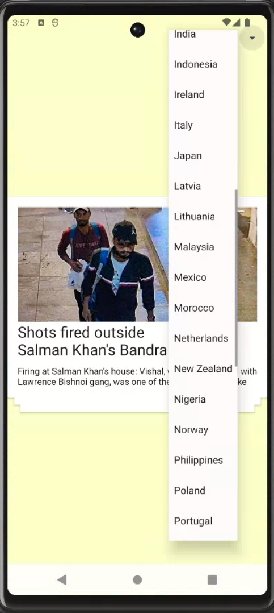
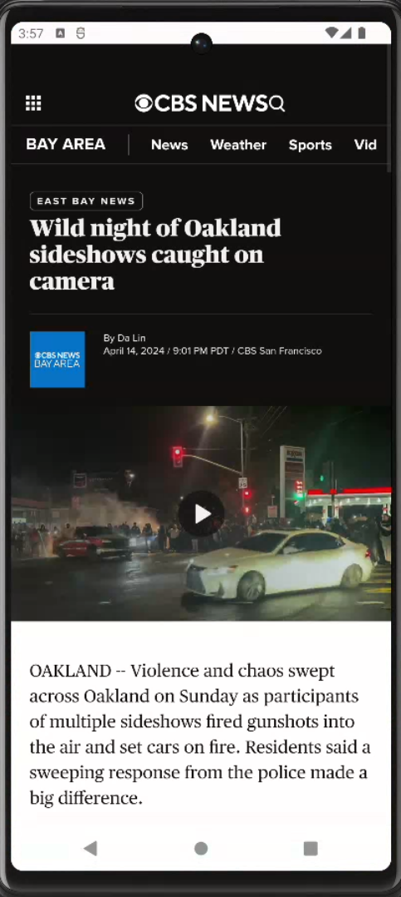

# NewsApp

NewsApp is an Android application developed using Kotlin and Android Studio. It provides users with the latest news from different countries using the News API. Users can select their preferred country to get news from and navigate through news articles using a stack layout. Additionally, users can read the full article by clicking on a news item, which opens in a webview.

## Features

- *News from Different Countries*: Users can select a country to get news from.
- *Stack Layout Navigation*: Users can navigate through news articles using a stack layout.
- *Full Article View*: Users can read the full article by clicking on a news item, which opens in a webview.
- *Dynamic Theme*: The app changes its color theme when users switch between news articles.

## Screenshots

## Installation

To run this application, follow these steps:

1. Clone the repository using git clone.
2. Open the project in Android Studio.
3. Build and run the project on your Android device or emulator.

## Dependencies

This project uses the following dependencies:

- Retrofit: For making HTTP requests to the News API.
- Gson: For parsing JSON responses from the News API.
- Glide: For loading and caching images from news articles.
- WebView: For displaying the full article content.

You can find the dependencies listed in the build.gradle files.

## Contributing

Contributions are welcome! If you want to contribute to this project, please fork the repository, create a new branch, make your changes, and submit a pull request.
